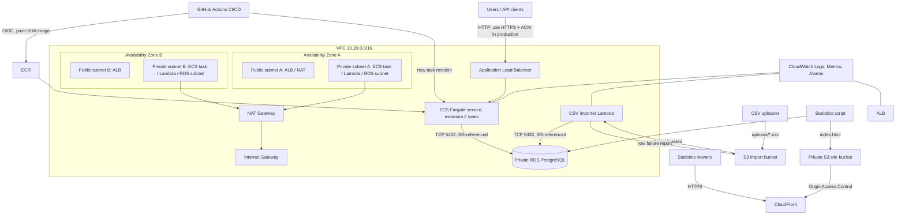

# AWS Order Processing Service

This repository is a reproducible migration reference for X-Company's order service. It uses a stateless FastAPI container on Amazon ECS Fargate, an Application Load Balancer, private PostgreSQL on RDS, an S3-triggered Lambda importer, and an S3/CloudFront statistics site. Terraform provisions the AWS resources; GitHub Actions tests, scans, publishes, and rolls out immutable images.

## Architecture



### Request and data flow

API traffic reaches the internet-facing ALB in both public subnets. Its security group accepts port 80 and can reach only ECS port 8080. The ALB selects a healthy task in either private subnet; the task security group accepts only the ALB security group. The application uses a bounded, pre-pinged SQLAlchemy pool to reach RDS on port 5432. The database security group accepts 5432 only from ECS and the importer Lambda security groups, and RDS has no public address.

For bulk input, a CSV is uploaded under `uploads/` in the private import bucket. S3 invokes the VPC-attached Lambda. It retrieves credentials from Secrets Manager, validates each row, commits it independently, and writes an import report under `import-reports/`. Application tasks and Lambda use the NAT gateway for AWS/public endpoints when needed; all business data remains in RDS.

## Services and decisions

ECS Fargate was selected because it preserves container/runtime control without requiring EC2 host patching or an EKS control plane. Two tasks span Availability Zones, ALB health checks remove failed tasks, ECS restores desired count, and rolling deployments keep 100% healthy capacity while starting the new revision. Fargate tasks have no public IP and persist no business data locally.

RDS PostgreSQL provides transactions, constraints, backups, encryption, and a standard migration target. Secrets Manager generates and stores the master secret; credentials are injected at runtime and URL-encoded by the application. For production, create a separate least-privilege application role through a controlled schema migration and rotate it automatically. The assessment uses the managed database secret to keep bootstrapping reproducible.

The application pool permits at most 10 connections per task (`5 + 5 overflow`). With the production maximum of 12 tasks, reserve at least 120 application connections plus Lambda and administration headroom. Set the task cap from the RDS class's `max_connections`; at higher scale add RDS Proxy, cap Lambda concurrency, and monitor `DatabaseConnections` and connection wait time.

The static statistics page is generated out of band by `scripts/generate_stats.py` and served from a private S3 origin through CloudFront. Application servers never serve it.

## Local use

Prerequisites: Python 3.12, Docker, Terraform 1.7+, AWS CLI v2, and an AWS account for deployment.

```powershell
python -m venv .venv
.\.venv\Scripts\Activate.ps1
pip install -r requirements-dev.txt
pytest -q
docker compose up --build
```

Exercise the API:

```powershell
$order = Invoke-RestMethod -Method Post -Uri http://localhost:8080/orders -ContentType application/json -Body '{"customer_id":"c-100","product_id":"p-42","quantity":2}'
Invoke-RestMethod "http://localhost:8080/orders/$($order.order_id)"
Invoke-RestMethod http://localhost:8080/orders
Invoke-RestMethod http://localhost:8080/health
```

## Provision AWS

Authenticate with AWS through an approved profile or workload identity. No access keys belong in this repository. The Lambda dependency archive must exist before Terraform plans because Terraform hashes it.

```powershell
.\scripts\build_lambda.ps1
terraform -chdir=terraform init
Copy-Item terraform\environments\dev.tfvars.example terraform\dev.tfvars
terraform -chdir=terraform apply -var-file=dev.tfvars -target=aws_ecr_repository.app
```

Set `github_repository="owner/repository"` in the environment tfvars to provision the least-privilege deploy role. If CloudTrail shows GitHub emitting immutable owner/repository IDs in the OIDC `sub` claim, set that exact main-branch value as `github_oidc_subject`. Set `create_github_oidc_provider=true` only if the account does not already have GitHub's account-wide OIDC provider, then store the `github_deploy_role_arn` output as the repository secret `AWS_DEPLOY_ROLE_ARN`.

The targeted bootstrap creates only ECR because the first image cannot be pushed before its repository exists. Build and push the first immutable application image, then run the complete plan/apply. Do not run a full apply with the placeholder `container_image` default.

```powershell
$repo = terraform -chdir=terraform output -raw ecr_repository_url
$tag = git rev-parse HEAD
aws ecr get-login-password --region ap-south-1 | docker login --username AWS --password-stdin ($repo.Split('/')[0])
docker build -t "${repo}:${tag}" .
docker push "${repo}:${tag}"
terraform -chdir=terraform plan -var-file=dev.tfvars -var "container_image=${repo}:${tag}" -out=dev.plan
terraform -chdir=terraform apply dev.plan
terraform -chdir=terraform output
```

Upload a bulk file and publish statistics:

```powershell
$imports = terraform -chdir=terraform output -raw import_bucket
aws s3 cp examples/orders.csv "s3://$imports/uploads/orders.csv"

# Use the read API from an operator workstation, or use --database-url from a VPC-reachable runner.
python scripts/generate_stats.py --api-url (terraform -chdir=terraform output -raw api_url) --bucket (terraform -chdir=terraform output -raw statistics_bucket)
python scripts/generate_stats.py --database-url $env:DATABASE_URL --bucket (terraform -chdir=terraform output -raw statistics_bucket)
```

Destroy development resources with `terraform -chdir=terraform destroy -var-file=dev.tfvars`. Production enables deletion protection and requires an intentional change before destruction. S3 objects and the final RDS snapshot are retained by the production posture.

Environment differences live in `terraform/environments/*.tfvars`; use separate AWS accounts and separate remote state backends for development, staging, and production. The sample uses local state to remain self-contained. In a team, initialize with an encrypted, versioned S3 backend and DynamoDB lock (or HCP Terraform), and never commit state because it can contain sensitive values.

## Bulk import reliability

Required CSV headers are `customer_id,product_id,quantity`. Invalid business rows are recorded and skipped without aborting the file. A stable SHA-256 idempotency key combines bucket, key, object version, and row number; the database unique constraint and `ON CONFLICT DO NOTHING` prevent duplicates when S3 or Lambda retries. Valid rows commit independently, so a transient failure can safely retry the file. Unhandled infrastructure/database errors fail the invocation and use Lambda's asynchronous retry behavior. In production, configure an SQS dead-letter/on-failure destination, alarm on its depth, and consider S3 -> SQS -> Lambda for explicit redrive and backpressure. Versioned correction files intentionally create new orders.

## CI/CD, health, and rollback

On each `main` push, `.github/workflows/deploy.yml` installs dependencies, runs Ruff and pytest, builds a SHA-tagged image, fails on fixable high/critical Trivy findings, pushes to immutable ECR, registers a task revision, deploys, and waits for ECS stability. Terraform provisions the repository-scoped GitHub OIDC role; configure its `github_deploy_role_arn` output as `AWS_DEPLOY_ROLE_ARN`. No long-lived AWS keys are used.

ECS starts new tasks before draining old ones. Container and target-group checks call `/health`; unhealthy tasks never enter the target group. The ECS deployment circuit breaker automatically rolls back a failed rollout. To roll back deliberately, dispatch the workflow with a known prior SHA tag, or run:

```powershell
.\scripts\rollback.ps1 -Cluster order-service-prod -Service order-service-prod -TaskDefinition order-service-prod:PREVIOUS_REVISION
```

## Monitoring, scaling, and incident investigation

CloudWatch receives structured access logs from ECS and native Lambda logs. Container Insights supplies task CPU/memory; ALB publishes request, latency, response-code, healthy-host, and target metrics; RDS Performance Insights and CloudWatch cover load, connections, storage, and latency. Alarms are provisioned for target 5xx errors, sustained ECS CPU, and Lambda errors, with optional SNS email notification.

For intermittent 5xx responses, first correlate the alarm window with ALB `HTTPCode_ELB_5XX_Count` versus `HTTPCode_Target_5XX_Count`, `TargetResponseTime`, and healthy-host count. ELB 5xx points to target/network availability; target 5xx points to application logs. Filter `/ecs/<name>` by request path/status and correlate database exceptions with RDS connections, CPU, free storage, read/write latency, Performance Insights waits, and failover events. Check ECS stopped-task reasons/deployments, Lambda/import load, NAT metrics, security-group and route changes, and VPC Flow Logs (recommended production addition). Reproduce through the ALB and directly from a diagnostic task to isolate ALB versus application/database behavior.

Target-tracking adds tasks when average CPU exceeds 60%, and the ALB distributes traffic across tasks/AZs. A 5-10x increase initially queues at the ALB while tasks start; pre-scale for predictable events and load-test the maximum. Non-CPU bottlenecks include RDS connection count/query locks and IOPS, ALB target response latency, NAT connection/port capacity, downstream API quotas, memory, and Lambda concurrency. RDS Proxy, query/index tuning, read replicas where semantically valid, VPC endpoints, caching, and raising tested task limits address these constraints.

Failure drill: note `HealthyHostCount`, stop one task with `aws ecs stop-task --cluster <cluster> --task <task-arn> --reason assessment-drill`, and continuously call `/health` and `/orders`. The ALB removes the target after failed checks, the second task continues serving, and ECS launches a replacement to restore desired count. Capture the stopped-task event, healthy-host dip/recovery, replacement task, uninterrupted requests, and CloudWatch logs for the recording. Do not run the drill against an unapproved production environment.

## Security and cost assumptions

RDS, ECS, Lambda, and both S3 buckets are private; security-group references restrict east-west traffic. Storage is encrypted, S3 public access is blocked, CloudFront uses signed origin access, ECR scans on push, IAM roles replace static credentials, and logs are retained for 30 days. Add ACM HTTPS, AWS WAF, API authentication/authorization, CloudTrail, GuardDuty, VPC Flow Logs, KMS customer-managed keys, secret rotation, and a separate app DB role before production. HTTP remains in this assessment because no domain/certificate was supplied.

One NAT gateway and a single-AZ development RDS minimize assessment cost. Production should use one NAT gateway per AZ (or VPC endpoints plus controlled egress), Multi-AZ RDS, deletion protection, PITR retention, cross-account backups, and tested restore procedures. NAT gateway, ALB, RDS, Fargate, CloudFront, and logs incur charges; destroy the dev stack when finished.

## Known limitations

AWS deployment, DNS/TLS, GitHub repository creation, CI execution, and the required screen recording need the candidate's AWS/GitHub credentials and domain choices and therefore are not executed by repository code. Terraform uses one NAT gateway to control cost. Schema creation currently happens idempotently at API startup; a production release should run versioned migrations as a one-off ECS task before service deployment. The simple API has no authentication because the scenario explicitly permits anyone with an order ID to read it; production customer data requires authorization and rate limiting. The importer uses direct RDS access; at higher volume use RDS Proxy and SQS buffering.

The detailed production migration is in [docs/MIGRATION.md](docs/MIGRATION.md), and the evidence sequence for the required recording is in [docs/DEMO.md](docs/DEMO.md).
